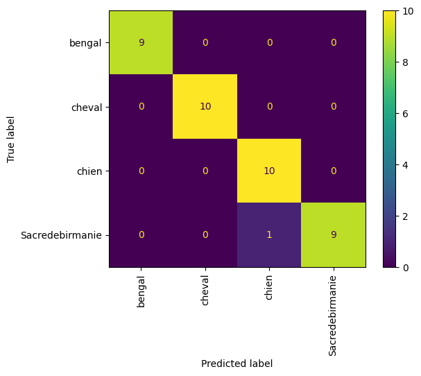
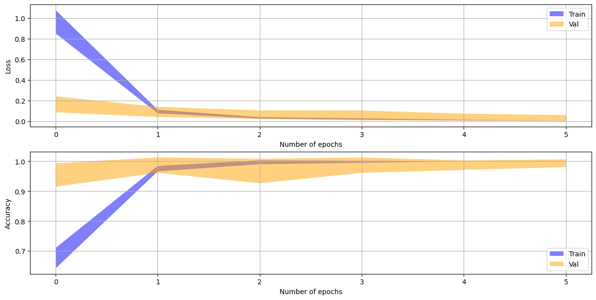
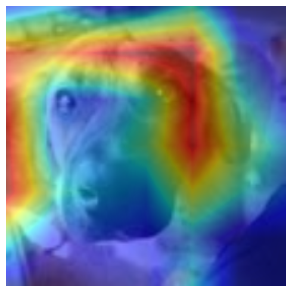

# Rapport ARN - Labo final
*par Léonard Jouve & Zaïd Schouwey*
## 1. Introduction
Ce rapport présente une application de classification d'images utilisant des réseaux de neurones convolutifs (CNN) avec une approche de transfer learning. L'objectif est de créer un modèle capable de reconnaître quatre classes d'animaux : bengal, cheval, chien et Sacredebimanie. La méthodologie comprend la création d'un jeu de données personnalisé, l'utilisation de techniques d'augmentation de données, l'entraînement d'un modèle MobileNetV2 pré-entraîné avec des couches personnalisées, et l'évaluation des performances du modèle.
Les données que nous avons collectées proviennent de photos prisent depuis notre téléphone ou de publication sur Facebook.

## 2. Le problème
### Classes cibles
- Bengal
- Cheval
- Chien
- Sacredebimanie

### Description des données
Le jeu de données est équilibré avec 48 images par classe. La répartition est la suivante :
- Bengal : 48 images
- Cheval : 48 images
- Chien : 48 images
- Sacredebimanie : 48 images

Les images présentent une diversité intra-classe (par exemple, différentes races de chiens) et certaines similarités inter-classes (comme entre le bengal et le sacré de birmanie), ce qui peut rendre la classification plus difficile.

## 3. Préparation des données
### Prétraitement
- Redimensionnement des images à 224x224 pixels
- Normalisation des valeurs de pixels entre 0 et 1
- Augmentation des données avec :
  - Retournement horizontal et vertical aléatoire
  - Rotation aléatoire (20%)
  - Zoom aléatoire (20%)
  - Contraste aléatoire (20%)

### Division des données
- 80% pour l'entraînement (153 images)
- 20% pour le test (39 images)
- Validation croisée 5 folds utilisée pendant l'entraînement

## 4. Création du modèle
### Architecture
- Modèle de base : MobileNetV2 pré-entraîné (poids gelés)
- Couches ajoutées :
  - GlobalAveragePooling2D()
  - Dense(256, activation='relu')
  - Dropout(0.2)
  - Dense(4, activation='softmax')

### Hyperparamètres
- Optimiseur : Adam
- Fonction de perte : SparseCategoricalCrossentropy
- Métrique : Accuracy
- Taille de batch : 16
- Nombre d'époques : 6

### Transfer learning
Le transfer learning a été utilisé avec MobileNetV2 pour réutiliser des caractéristiques apprises sur ImageNet. Cela permet d'obtenir de bonnes performances même avec un petit jeu de données. En effet on peut conserver les premières couches du modèle car elles permettent de reconnaitre des caractéristiques génériques et simples. On freeze alors les poids des premières couches qui on dejà été entrainées. On ajoutes ensuite uniquement des couches supplémentaire permettant de spécialiser le modèle pour notre scénario.

## 5. Résultats
### Performances sur le test set
- F1-score (pondéré) : 0.98
- Matrice de confusion :
---
  
- F1-score par classe:
```
Rapport de classification par classe:
                  precision    recall  f1-score   support

Sacredebirmanie     1.0000    1.0000    1.0000         9
         bengal     1.0000    1.0000    1.0000        10
         cheval     0.9091    1.0000    0.9524        10
          chien     1.0000    0.9000    0.9474        10

       accuracy                         0.9744        39
      macro avg     0.9773    0.9750    0.9749        39
   weighted avg     0.9767    0.9744    0.9743        39

F1-score pour la classe Sacredebirmanie: 1.0000
F1-score pour la classe bengal: 1.0000
F1-score pour la classe cheval: 0.9524
F1-score pour la classe chien: 0.9474
```

### Performances depuis l'application mobile
Nous avons également pu tester notre modèle en situation réelle. En effet, nous avons fait une application mobile permettant de classifier une photo directement prise depuis notre téléphone. Nous n'avons malheureusement pas beaucoup utilisé l'application. Les résultats sont alors moins représentatifs de la réalité mais tout de même bons. 

Une photo d’un cheval prise en pleine journée a été correctement classifiée sans difficulté.
Un chien photographié en intérieur a également été correctement classifié avec score de confiance moyen.
Par contre une image de sacré de Birmanie également prise en appartement mais cette fois dans la pénombre n'a pas été classifiée correctement. Le modèle l'a confondu avec un Bengal. On peut imaginer que la faible luminosité a pu perturber la reconnaissance du pelage du sacré de Birmanie. En effet, une autre photo du même chat prise à la lumière prédit la bonne classification.

Ces observations montrent que le modèle reste performant avec des photos provenant de situations réelles simples.

### Loss & accuracy


### Analyse des erreurs
Une image a été mal classée (Chien classée comme Cheval). L'analyse Grad-CAM montre que le modèle se concentre généralement sur les régions pertinentes des images. Cepandant, pour le bengal, nous prenons principalement les motifs sur ses poils ce qui pourrait être un problème si l'on avait une classe léopart par exemple.

Cette erreur est probablement due a la couleur du chien. On voit que le model n'a pas prit en compte son visage mais plutôt son corps.



### Améliorations possibles
- Ajouter plus de variété dans les images (différents angles, éclairages, arrière-plans)
- Inclure des images d'objets ne faisant partie d'aucune classe pour améliorer la robustesse
- Augmenter la taille du jeu de données

## 6. Conclusion
Le modèle atteint de bonnes performances (98% de F1-score) sur le jeu de test. L'approche de transfer learning avec MobileNetV2 s'est avérée efficace malgré la petite taille du jeu de données. Les principales limites sont :
- Peu d'images pour certaines classes
- Manque de diversité dans les conditions de prise de vue
- Performance à améliorer en conditions réelles

Pour des travaux futurs, on pourrait :
- Collecter un jeu de données plus important et diversifié
- Expérimenter avec d'autres architectures de base
- Implémenter des techniques d'augmentation de données plus avancées
